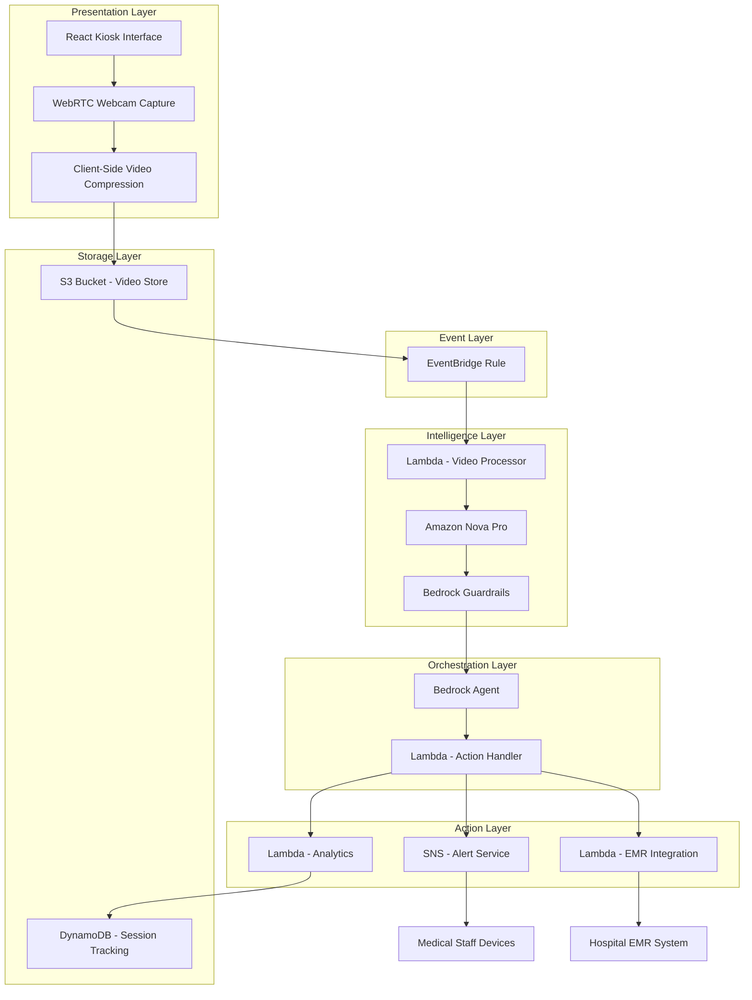

# Design Document: SignAI Emergency Kiosk

## Overview

SignAI is a serverless, event-driven medical emergency kiosk system that enables non-verbal patients in Indian Emergency Rooms to communicate medical emergencies through sign language interpretation. The system leverages AWS AI services including Amazon Nova Pro for multi-modal video reasoning, Bedrock Agents for intelligent orchestration, and Bedrock Guardrails for privacy protection compliant with India's DPDP Act 2023.

### Design Philosophy

The architecture follows three core principles:

1. **Event-Driven Serverless**: All components are stateless and triggered by events, ensuring high availability, automatic scaling, and cost efficiency
2. **Agentic Intelligence**: Bedrock Agents orchestrate complex emergency response workflows, making intelligent decisions about routing, prioritization, and action execution
3. **Privacy-First**: Bedrock Guardrails enforce PII redaction and content safety at every stage, ensuring DPDP Act compliance

### System Flow

```
Patient → Kiosk (React) → S3 Upload → EventBridge → Nova Pro → Bedrock Agent → Lambda/SNS → Medical Staff
                ↓                                                    ↓
          Client-Side                                        Guardrails (PII/Safety)
          Compression
```

## Architecture

### High-Level Architecture

The system consists of four primary layers:

1. **Presentation Layer**: React-based kiosk interface with webcam capture and client-side video compression
2. **Intelligence Layer**: Amazon Nova Pro for multi-modal sign language interpretation
3. **Orchestration Layer**: Bedrock Agents coordinating emergency response workflows
4. **Action Layer**: AWS Lambda functions and Amazon SNS for alert delivery and system integration

### Event-Driven Flow

The complete emergency communication pipeline operates through the following event-driven sequence:

**Stage 1: Video Capture and Upload (0-7 seconds)**
- Patient records sign language input through Kiosk_Interface
- Client-side compression reduces video size (target: <5MB for 10s video)
- Compressed video uploads to S3 bucket with encryption at rest (AES-256)
- S3 triggers EventBridge rule upon successful upload

**Stage 2: AI Interpretation (7-12 seconds)**
- EventBridge invokes Lambda function with S3 object metadata
- Lambda retrieves video from S3 and invokes Amazon Nova Pro
- Nova Pro performs multi-modal analysis: gesture recognition, facial expression analysis, contextual understanding
- Nova Pro returns structured interpretation: emergency type, severity (Critical/Urgent/Standard), confidence score

**Stage 3: Privacy and Safety Filtering (12-13 seconds)**
- Interpretation results pass through Bedrock Guardrails
- PII detection and redaction: names, addresses, Aadhaar numbers, medical record numbers
- Content safety filtering: harmful or inappropriate content blocked
- Filtered results forwarded to Bedrock Agent

**Stage 4: Agentic Orchestration (13-15 seconds)**
- Bedrock Agent receives filtered interpretation
- Agent determines appropriate response workflow based on emergency type and severity
- Agent selects relevant Emergency_Contact personnel from hospital directory
- Agent generates multi-lingual alert messages based on recipient language preferences
- Agent invokes Action_Handler Lambda functions in parallel

**Stage 5: Alert Delivery (15-17 seconds)**
- Lambda functions publish messages to SNS topics
- SNS delivers alerts via SMS, push notifications, and in-hospital paging systems
- Lambda functions update hospital EMR systems with emergency flag
- Confirmation messages sent back to Kiosk_Interface

**Total Pipeline Latency Target**: <10 seconds for 95th percentile

### AWS Service Architecture



### Deployment Architecture

**Regional Deployment**: Mumbai (ap-south-1) for primary deployment serving Indian hospitals

**Multi-AZ Configuration**:
- S3: Automatic multi-AZ replication
- Lambda: Deployed across multiple AZs
- DynamoDB: Global tables with multi-region replication for disaster recovery

**Edge Optimization**:
- CloudFront distribution for kiosk static assets
- S3 Transfer Acceleration for video uploads from low-bandwidth networks

## Components and Interfaces

### 1. Kiosk Interface (React Application)

**Technology Stack**:
- React 18 with TypeScript
- WebRTC for webcam access
- FFmpeg.wasm for client-side video compression
- AWS Amplify for S3 upload with progress tracking

**Key Components**:

**VideoCapture Component**:
```typescript
interface VideoCaptureProps {
  onRecordingComplete: (videoBlob: Blob) => void;
  maxDuration: number; // seconds
}

interface VideoMetadata {
  duration: number;
  resolution: { width: number; height: number };
  frameRate: number;
  timestamp: string;
}
```

**VideoCompressor Component**:
```typescript
interface CompressionConfig {
  targetBitrate: number; // kbps
  codec: 'h264' | 'vp9';
  resolution: { width: number; height: number };
}

interface CompressionResult {
  compressedBlob: Blob;
  originalSize: number;
  compressedSize: number;
  compressionRatio: number;
  compressionTime: number; // milliseconds
}
```

**S3Uploader Component**:
```typescript
interface UploadConfig {
  bucket: string;
  region: string;
  useAcceleration: boolean;
}

interface UploadProgress {
  bytesUploaded: number;
  totalBytes: number;
  percentage: number;
  estimatedTimeRemaining: number; // seconds
}

interface UploadResult {
  s3Key: string;
  s3Url: string;
  uploadTime: number; // milliseconds
}
```

**Accessibility Features**:
- High contrast mode with 4.5:1 minimum contrast ratio
- Touch targets minimum 44x44 pixels
- Multi-language support: Hindi, English, Tamil, Telugu, Bengali, Marathi, Gujarati, Kannada, Malayalam, Punjabi
- Visual pictograms for instructions
- Haptic feedback for touch interactions
- Screen reader compatibility

### 2. Video Processor (Lambda + Nova Pro)

**Lambda Configuration**:
- Runtime: Python 3.12
- Memory: 2048 MB
- Timeout: 30 seconds
- Concurrency: 100 reserved concurrent executions
- Environment: VPC-enabled for secure S3 access

**Nova Pro Integration**:
```python
class NovaProClient:
    def analyze_sign_language(
        self,
        video_s3_uri: str,
        analysis_config: AnalysisConfig
    ) -> InterpretationResult:
        """
        Invokes Amazon Nova Pro for multi-modal video analysis
        
        Args:
            video_s3_uri: S3 URI of the video file
            analysis_config: Configuration for analysis parameters
            
        Returns:
            InterpretationResult containing emergency classification
        """
        pass

class AnalysisConfig:
    model_id: str = "amazon.nova-pro-v1:0"
    temperature: float = 0.3  # Low temperature for consistent medical interpretation
    max_tokens: int = 1000
    analysis_prompt: str = """
    Analyze this sign language video and identify:
    1. Type of medical emergency being communicated
    2. Severity level (Critical/Urgent/Standard)
    3. Key symptoms or conditions mentioned
    4. Confidence score for interpretation
    
    Respond in structured JSON format.
    """

class InterpretationResult:
    emergency_type: str  # e.g., "chest_pain", "difficulty_breathing", "severe_injury"
    severity: str  # "Critical" | "Urgent" | "Standard"
    symptoms: List[str]
    confidence_score: float  # 0.0 to 1.0
    raw_interpretation: str
    processing_time: float  # seconds
```

**Emergency Classification Logic**:
- Critical: Chest pain, difficulty breathing, severe bleeding, loss of consciousness, stroke symptoms
- Urgent: Severe pain, high fever, moderate injury, allergic reaction
- Standard: Minor injury, mild symptoms, general consultation

### 3. Privacy Guardian (Bedrock Guardrails)

**Guardrail Configuration**:
```python
class GuardrailConfig:
    guardrail_id: str
    guardrail_version: str = "DRAFT"
    
    # PII Detection and Redaction
    pii_entities: List[str] = [
        "NAME",
        "ADDRESS", 
        "PHONE",
        "EMAIL",
        "AADHAAR_NUMBER",  # Indian national ID
        "MEDICAL_RECORD_NUMBER",
        "DATE_OF_BIRTH",
        "BIOMETRIC_DATA"
    ]
    
    # Content Filtering
    content_filters: Dict[str, str] = {
        "hate": "HIGH",
        "insults": "MEDIUM",
        "sexual": "HIGH",
        "violence": "MEDIUM",  # Medical context requires nuanced violence filtering
        "misconduct": "HIGH"
    }
    
    # Topic Filtering
    denied_topics: List[str] = [
        "non_medical_requests",
        "financial_information",
        "legal_advice"
    ]

class GuardrailResult:
    action: str  # "ALLOWED" | "BLOCKED"
    filtered_content: str
    detected_pii: List[PIIEntity]
    content_violations: List[ContentViolation]
    processing_time: float  # milliseconds

class PIIEntity:
    type: str
    original_text: str
    redacted_text: str
    confidence: float
```

**DPDP Act Compliance**:
- Data minimization: Only essential data collected and processed
- Purpose limitation: Data used only for emergency communication
- Storage limitation: Videos deleted within 24 hours
- Security safeguards: Encryption at rest (AES-256) and in transit (TLS 1.3)
- Consent: Implicit consent through kiosk usage with clear signage
- Data principal rights: Patients can request deletion of their data

### 4. Agent Orchestrator (Bedrock Agent)

**Agent Configuration**:
```python
class BedrockAgentConfig:
    agent_id: str
    agent_alias_id: str
    foundation_model: str = "anthropic.claude-3-sonnet-20240229-v1:0"
    
    # Agent Instructions
    instruction: str = """
    You are an emergency response coordinator for a hospital ER.
    
    Your responsibilities:
    1. Analyze emergency interpretations and determine appropriate response workflows
    2. Select relevant medical personnel based on emergency type and severity
    3. Generate multi-lingual alert messages
    4. Coordinate parallel actions: alerts, EMR updates, analytics
    
    Decision Rules:
    - Critical emergencies: Alert trauma team, ER attending, charge nurse
    - Urgent emergencies: Alert on-duty physician, triage nurse
    - Standard emergencies: Alert triage nurse, add to queue
    
    Always prioritize patient safety and rapid response.
    """
    
    # Action Groups
    action_groups: List[ActionGroup] = [
        ActionGroup(
            name="alert_medical_staff",
            description="Send emergency alerts to medical personnel",
            lambda_arn="arn:aws:lambda:ap-south-1:ACCOUNT:function:signai-alert-handler"
        ),
        ActionGroup(
            name="update_emr_system",
            description="Update hospital EMR with emergency flag",
            lambda_arn="arn:aws:lambda:ap-south-1:ACCOUNT:function:signai-emr-integration"
        ),
        ActionGroup(
            name="log_analytics",
            description="Log emergency event for analytics and quality improvement",
            lambda_arn="arn:aws:lambda:ap-south-1:ACCOUNT:function:signai-analytics"
        )
    ]
    
    # Knowledge Base (Optional)
    knowledge_base_id: Optional[str] = None  # Hospital protocols and procedures

class AgentInvocationInput:
    session_id: str
    interpretation_result: InterpretationResult
    patient_metadata: PatientMetadata
    timestamp: str

class AgentInvocationResult:
    actions_taken: List[ActionResult]
    reasoning: str
    total_processing_time: float  # seconds
```

**Workflow Determination Logic**:

The Bedrock Agent uses the following decision tree:

1. **Emergency Type Classification**: Map interpreted emergency to medical specialty
2. **Severity-Based Routing**: Determine personnel tier based on severity
3. **Language Preference Matching**: Select alert language based on staff preferences
4. **Parallel Action Execution**: Invoke all required actions simultaneously
5. **Confirmation and Logging**: Track action results and log for audit

### 5. Action Handler (Lambda Functions)

**Alert Handler Lambda**:
```python
class AlertHandler:
    def __init__(self, sns_client, dynamodb_client):
        self.sns = sns_client
        self.db = dynamodb_client
    
    def send_alert(
        self,
        emergency_contact: EmergencyContact,
        alert_message: AlertMessage
    ) -> AlertResult:
        """
        Sends multi-lingual emergency alert via SNS
        
        Args:
            emergency_contact: Recipient information and preferences
            alert_message: Alert content and metadata
            
        Returns:
            AlertResult with delivery status
        """
        pass

class EmergencyContact:
    contact_id: str
    name: str
    role: str  # "trauma_surgeon", "er_attending", "triage_nurse"
    phone_number: str
    language_preference: str  # ISO 639-1 code
    notification_channels: List[str]  # ["sms", "push", "pager"]

class AlertMessage:
    emergency_type: str
    severity: str
    symptoms: List[str]
    kiosk_location: str
    timestamp: str
    confidence_score: float
    
    # Multi-lingual content
    message_templates: Dict[str, str]  # language_code -> message_template

class AlertResult:
    message_id: str
    delivery_status: str  # "DELIVERED" | "PENDING" | "FAILED"
    delivery_time: float  # milliseconds
    channel_used: str
```

**EMR Integration Lambda**:
```python
class EMRIntegration:
    def update_emergency_flag(
        self,
        patient_identifier: str,
        emergency_data: EmergencyData
    ) -> EMRUpdateResult:
        """
        Updates hospital EMR system with emergency flag
        
        Args:
            patient_identifier: Patient ID or temporary kiosk session ID
            emergency_data: Emergency classification and details
            
        Returns:
            EMRUpdateResult with update status
        """
        pass

class EmergencyData:
    emergency_type: str
    severity: str
    symptoms: List[str]
    timestamp: str
    kiosk_id: str
    interpretation_confidence: float

class EMRUpdateResult:
    update_status: str  # "SUCCESS" | "FAILED"
    emr_record_id: str
    update_time: float  # milliseconds
```

**Analytics Lambda**:
```python
class AnalyticsLogger:
    def log_emergency_event(
        self,
        event_data: EmergencyEvent
    ) -> None:
        """
        Logs emergency event to DynamoDB for analytics
        
        Args:
            event_data: Complete event information for analysis
        """
        pass

class EmergencyEvent:
    event_id: str
    timestamp: str
    kiosk_id: str
    emergency_type: str
    severity: str
    interpretation_confidence: float
    processing_latency: ProcessingLatency
    alert_delivery_status: List[AlertResult]
    
class ProcessingLatency:
    video_upload_time: float
    compression_time: float
    interpretation_time: float
    guardrail_time: float
    agent_orchestration_time: float
    alert_delivery_time: float
    total_pipeline_time: float
```

### 6. Alert Service (Amazon SNS)

**SNS Topic Architecture**:
- **Critical Alerts Topic**: For life-threatening emergencies
- **Urgent Alerts Topic**: For serious but non-life-threatening emergencies
- **Standard Alerts Topic**: For routine emergency communications

**Multi-Lingual Message Formatting**:
```python
class MultiLingualFormatter:
    def format_alert(
        self,
        emergency_data: EmergencyData,
        target_language: str
    ) -> str:
        """
        Formats emergency alert in target language
        
        Preserves medical terminology accuracy while translating context
        """
        pass
    
    # Supported languages with medical terminology dictionaries
    SUPPORTED_LANGUAGES = {
        "hi": "Hindi",
        "en": "English", 
        "ta": "Tamil",
        "te": "Telugu",
        "bn": "Bengali",
        "mr": "Marathi",
        "gu": "Gujarati",
        "kn": "Kannada",
        "ml": "Malayalam",
        "pa": "Punjabi"
    }
```

## Data Models

### Video Metadata Model

```python
class VideoMetadata:
    video_id: str  # UUID
    s3_key: str
    s3_bucket: str
    kiosk_id: str
    timestamp: datetime
    duration: float  # seconds
    original_size: int  # bytes
    compressed_size: int  # bytes
    compression_ratio: float
    resolution: VideoResolution
    frame_rate: int
    codec: str
    encryption_status: str  # "ENCRYPTED"
    ttl: int  # Unix timestamp for automatic deletion (24 hours)

class VideoResolution:
    width: int
    height: int
```

### Interpretation Model

```python
class InterpretationResult:
    interpretation_id: str  # UUID
    video_id: str  # Foreign key to VideoMetadata
    timestamp: datetime
    
    # Nova Pro Analysis Results
    emergency_type: EmergencyType
    severity: SeverityLevel
    symptoms: List[Symptom]
    confidence_score: float  # 0.0 to 1.0
    
    # Processing Metadata
    model_version: str  # "amazon.nova-pro-v1:0"
    processing_time: float  # seconds
    tokens_used: int
    
    # Guardrail Results
    pii_detected: List[PIIEntity]
    content_violations: List[ContentViolation]
    guardrail_action: str  # "ALLOWED" | "BLOCKED"

class EmergencyType(Enum):
    CHEST_PAIN = "chest_pain"
    DIFFICULTY_BREATHING = "difficulty_breathing"
    SEVERE_BLEEDING = "severe_bleeding"
    LOSS_OF_CONSCIOUSNESS = "loss_of_consciousness"
    STROKE_SYMPTOMS = "stroke_symptoms"
    SEVERE_INJURY = "severe_injury"
    SEVERE_PAIN = "severe_pain"
    HIGH_FEVER = "high_fever"
    ALLERGIC_REACTION = "allergic_reaction"
    MINOR_INJURY = "minor_injury"
    GENERAL_CONSULTATION = "general_consultation"

class SeverityLevel(Enum):
    CRITICAL = "Critical"
    URGENT = "Urgent"
    STANDARD = "Standard"

class Symptom:
    symptom_name: str
    confidence: float
    medical_code: Optional[str]  # ICD-10 code if applicable
```

### Emergency Session Model

```python
class EmergencySession:
    session_id: str  # UUID
    kiosk_id: str
    start_timestamp: datetime
    end_timestamp: Optional[datetime]
    
    # Video Processing
    video_metadata: VideoMetadata
    interpretation_result: InterpretationResult
    
    # Agent Orchestration
    agent_session_id: str
    actions_taken: List[ActionResult]
    
    # Alert Delivery
    alerts_sent: List[AlertDelivery]
    
    # Status Tracking
    pipeline_status: PipelineStatus
    total_latency: float  # seconds
    
    # Audit Trail
    created_at: datetime
    updated_at: datetime
    ttl: int  # Unix timestamp for automatic deletion

class PipelineStatus(Enum):
    VIDEO_UPLOADED = "video_uploaded"
    INTERPRETATION_IN_PROGRESS = "interpretation_in_progress"
    INTERPRETATION_COMPLETE = "interpretation_complete"
    GUARDRAIL_FILTERING = "guardrail_filtering"
    AGENT_ORCHESTRATING = "agent_orchestrating"
    ALERTS_SENDING = "alerts_sending"
    COMPLETE = "complete"
    FAILED = "failed"

class ActionResult:
    action_type: str  # "alert", "emr_update", "analytics"
    status: str  # "SUCCESS" | "FAILED"
    execution_time: float  # milliseconds
    error_message: Optional[str]

class AlertDelivery:
    alert_id: str
    contact_id: str
    contact_name: str
    contact_role: str
    language: str
    channel: str  # "sms" | "push" | "pager"
    delivery_status: str  # "DELIVERED" | "PENDING" | "FAILED"
    delivery_time: float  # milliseconds
    sns_message_id: str
```

### Hospital Configuration Model

```python
class HospitalConfig:
    hospital_id: str
    hospital_name: str
    location: HospitalLocation
    
    # Kiosk Configuration
    kiosks: List[KioskConfig]
    
    # Personnel Directory
    emergency_contacts: List[EmergencyContact]
    
    # Routing Rules
    routing_rules: RoutingRules
    
    # Language Preferences
    default_language: str
    supported_languages: List[str]

class KioskConfig:
    kiosk_id: str
    location: str  # "ER Entrance", "Triage Area", "Waiting Room"
    status: str  # "ACTIVE" | "INACTIVE" | "MAINTENANCE"
    last_health_check: datetime

class RoutingRules:
    critical_emergency_contacts: List[str]  # Contact IDs
    urgent_emergency_contacts: List[str]
    standard_emergency_contacts: List[str]
    escalation_timeout: int  # seconds before escalation
```

## Data Models


## Correctness Properties

A property is a characteristic or behavior that should hold true across all valid executions of a system—essentially, a formal statement about what the system should do. Properties serve as the bridge between human-readable specifications and machine-verifiable correctness guarantees.

### Property 1: Video Capture Technical Requirements

*For any* video recording session initiated by a patient, the captured video SHALL meet minimum technical specifications of 30 FPS frame rate and sufficient resolution for gesture recognition, and SHALL upload to Video_Store within 2 seconds of submission.

**Validates: Requirements 1.2, 1.5**

### Property 2: Event-Driven Pipeline Flow

*For any* video uploaded to Video_Store, the system SHALL automatically trigger the Video_Processor, which SHALL invoke the Agent_Orchestrator upon completion, which SHALL execute Action_Handler functions asynchronously, forming a complete event-driven chain without manual intervention.

**Validates: Requirements 2.1, 2.2, 2.3**

### Property 3: Error Handling and Retry Logic

*For any* component failure during processing, the system SHALL log detailed error information and retry the operation with exponential backoff timing.

**Validates: Requirements 2.4**

### Property 4: Interpretation Result Structure

*For any* sign language video processed by the Video_Processor, the interpretation result SHALL include emergency type classification, severity level (Critical/Urgent/Standard), symptoms list, and confidence score in a structured format.

**Validates: Requirements 3.1, 3.2, 3.3**

### Property 5: Interpretation Performance

*For any* video submitted for interpretation, the Video_Processor SHALL complete analysis and return results within 5 seconds of receiving the video.

**Validates: Requirements 3.4**

### Property 6: Low Confidence Flagging

*For any* interpretation result with confidence score below 70%, the system SHALL flag the case for human review.

**Validates: Requirements 3.5**

### Property 7: Agent Workflow Orchestration

*For any* interpretation result received by the Agent_Orchestrator, the agent SHALL determine the appropriate emergency response workflow, select relevant Emergency_Contact personnel based on emergency classification, and invoke Action_Handler functions to execute the workflow.

**Validates: Requirements 4.1, 4.2, 4.3**

### Property 8: Orchestration Performance

*For any* interpretation result, the Agent_Orchestrator SHALL complete workflow determination and action invocation within 3 seconds.

**Validates: Requirements 4.4**

### Property 9: Parallel Action Execution

*For any* emergency requiring multiple actions, the Agent_Orchestrator SHALL execute Action_Handler functions in parallel rather than sequentially, minimizing total response time.

**Validates: Requirements 4.5**

### Property 10: Multi-Lingual Alert Formatting

*For any* Emergency_Alert sent to a recipient, the Alert_Service SHALL format the message in the recipient's configured language preference from the supported set (Hindi, English, Tamil, Telugu, Bengali, Marathi, Gujarati, Kannada, Malayalam, Punjabi) while preserving critical medical terminology accuracy.

**Validates: Requirements 5.1, 5.2, 5.3**

### Property 11: Alert Delivery Performance

*For any* Emergency_Alert, the Alert_Service SHALL deliver the notification within 2 seconds of invocation.

**Validates: Requirements 5.4**

### Property 12: Alert Delivery Failover

*For any* Emergency_Contact where alert delivery fails, the Alert_Service SHALL attempt delivery through alternative notification channels.

**Validates: Requirements 5.5**

### Property 13: End-to-End Latency

*For any* 100 emergency communication flows, at least 95 SHALL complete the entire pipeline from video upload to Emergency_Alert delivery within 10 seconds.

**Validates: Requirements 6.1**

### Property 14: Pipeline Stage Timing Logs

*For any* pipeline execution, the system SHALL track and log processing time for each stage (upload, interpretation, guardrails, orchestration, alert delivery).

**Validates: Requirements 6.2**

### Property 15: High Latency Alerting

*For any* pipeline execution exceeding 15 seconds total processing time, the system SHALL trigger a high-latency alert to system administrators.

**Validates: Requirements 6.3**

### Property 16: Emergency Prioritization

*For any* mixed workload containing emergency and non-critical operations, the system SHALL process emergency requests before non-critical operations.

**Validates: Requirements 6.4**

### Property 17: PII Detection and Redaction

*For any* patient data processed by the Privacy_Guardian, all PII entities (name, address, phone number, Aadhaar number, medical record number, biometric data) SHALL be detected and redacted before data is stored or transmitted.

**Validates: Requirements 7.1, 7.2**

### Property 18: Data Encryption

*For any* video file stored in Video_Store, the file SHALL be encrypted at rest using AES-256 encryption, and *for any* data transmission between components, TLS 1.3 encryption SHALL be used.

**Validates: Requirements 7.3, 7.4**

### Property 19: Automatic Data Deletion

*For any* video file in Video_Store, the file SHALL be automatically deleted within 24 hours of processing completion.

**Validates: Requirements 7.5**

### Property 20: Content Safety Filtering

*For any* interpretation result analyzed by the Privacy_Guardian, harmful, abusive, or inappropriate content SHALL be detected and filtered, blocked content SHALL be logged for review, and legitimate medical emergency information SHALL be preserved while non-medical harmful content is blocked.

**Validates: Requirements 8.1, 8.2, 8.4**

### Property 21: Content Filtering Audit Logs

*For any* content filtering decision made by the Privacy_Guardian, an audit log entry SHALL be created for compliance review.

**Validates: Requirements 8.5**

### Property 22: System Metrics Emission

*For any* system event, the system SHALL emit metrics for video upload success rate, processing latency, interpretation accuracy, and alert delivery rate.

**Validates: Requirements 9.1**

### Property 23: Error Logging Detail

*For any* component error, the system SHALL log detailed error information including context and stack traces.

**Validates: Requirements 9.2**

### Property 24: Performance Degradation Alerting

*For any* system metrics indicating degraded performance, the system SHALL trigger automated alerts to operations teams.

**Validates: Requirements 9.4**

### Property 25: Emergency Event Audit Trails

*For any* emergency processing event, the system SHALL maintain an audit trail record for compliance and quality improvement.

**Validates: Requirements 9.5**

### Property 26: Multi-Modal Input Support

*For any* input modality (touch, gesture, adaptive switches), the Kiosk_Interface SHALL handle the input correctly.

**Validates: Requirements 10.2**

### Property 27: Multi-Language Instructions

*For any* language selection from the supported Indian languages, the Kiosk_Interface SHALL display instructions in the selected language.

**Validates: Requirements 10.4**

### Property 28: Severity Classification

*For any* Medical_Emergency interpretation, the Video_Processor SHALL classify the emergency severity as Critical, Urgent, or Standard, and *for any* Emergency_Alert generated, the severity classification and confidence score SHALL be included in the notification.

**Validates: Requirements 11.1, 11.2, 11.5**

### Property 29: Severity-Based Routing

*For any* emergency classification, the Agent_Orchestrator SHALL route Critical emergencies to immediate response teams and Urgent emergencies to on-duty staff according to configured routing rules.

**Validates: Requirements 11.3**

### Property 30: Concurrent Emergency Prioritization

*For any* set of concurrent emergencies, the system SHALL prioritize processing and alerting based on severity classification (Critical before Urgent before Standard).

**Validates: Requirements 11.4**

### Property 31: Service Unavailability Queuing

*For any* video processing request when the Video_Processor service is unavailable, the system SHALL queue the request and retry when service is restored.

**Validates: Requirements 12.1**

### Property 32: Action Failure Failover

*For any* Agent_Orchestrator action execution failure, the system SHALL attempt alternative action pathways to ensure alert delivery.

**Validates: Requirements 12.2**

### Property 33: Circuit Breaker Protection

*For any* component experiencing failures, the system SHALL implement circuit breakers that open to prevent cascading failures across other components.

**Validates: Requirements 12.3**

### Property 34: Failover Timing

*For any* component failure detected, the system SHALL automatically failover to backup resources within 30 seconds.

**Validates: Requirements 12.4**

### Property 35: Client-Side Video Compression

*For any* video captured by the Kiosk_Interface, client-side compression SHALL be performed before upload, achieving a target size of less than 5MB for a 10-second recording, using hardware-accelerated encoding where available, and completing within 1 second of recording completion.

**Validates: Requirements 13.1, 13.2, 13.3, 13.4**

### Property 36: Low-Bandwidth Upload Performance

*For any* compressed 3-second video uploaded under 2G network conditions (approximately 50 Kbps bandwidth), the upload SHALL complete within 5 seconds.

**Validates: Requirements 13.5**

## Error Handling

### Error Categories

The system handles four categories of errors:

1. **Transient Errors**: Temporary failures that can be resolved through retry (network timeouts, service throttling)
2. **Permanent Errors**: Failures that cannot be resolved through retry (invalid video format, corrupted data)
3. **Degraded Service Errors**: Partial failures where alternative pathways exist (primary alert channel fails, backup channel available)
4. **Critical System Errors**: Failures requiring immediate operator intervention (complete service outage, data corruption)

### Error Handling Strategies

**Retry with Exponential Backoff**:
```python
class RetryConfig:
    max_attempts: int = 3
    initial_delay: float = 1.0  # seconds
    max_delay: float = 60.0  # seconds
    exponential_base: float = 2.0
    jitter: bool = True  # Add randomization to prevent thundering herd

def calculate_retry_delay(attempt: int, config: RetryConfig) -> float:
    """
    Calculate delay before next retry attempt
    
    delay = min(initial_delay * (exponential_base ^ attempt), max_delay)
    """
    delay = min(
        config.initial_delay * (config.exponential_base ** attempt),
        config.max_delay
    )
    if config.jitter:
        delay = delay * (0.5 + random.random() * 0.5)
    return delay
```

**Circuit Breaker Pattern**:
```python
class CircuitBreakerState(Enum):
    CLOSED = "closed"  # Normal operation
    OPEN = "open"  # Failing, reject requests
    HALF_OPEN = "half_open"  # Testing if service recovered

class CircuitBreaker:
    failure_threshold: int = 5  # Open after 5 consecutive failures
    success_threshold: int = 2  # Close after 2 consecutive successes in half-open
    timeout: float = 60.0  # seconds before attempting half-open
    
    state: CircuitBreakerState = CircuitBreakerState.CLOSED
    failure_count: int = 0
    success_count: int = 0
    last_failure_time: Optional[datetime] = None
```

**Dead Letter Queue (DLQ)**:
- Failed messages after max retry attempts move to DLQ
- DLQ monitored by operations team for manual intervention
- DLQ messages include full context for debugging

**Graceful Degradation**:
- If Nova Pro unavailable: Queue requests, notify operators, display maintenance message
- If Bedrock Agent unavailable: Fall back to rule-based routing
- If primary SNS topic unavailable: Route to backup topic
- If EMR integration unavailable: Log locally, sync when restored

### Error Response Patterns

**Video Upload Errors**:
- Network timeout: Retry with exponential backoff
- Invalid video format: Return error to kiosk, prompt re-recording
- S3 service unavailable: Queue upload, retry when available

**Interpretation Errors**:
- Nova Pro timeout: Retry up to 3 times
- Low confidence (<70%): Flag for human review, send alert anyway
- Invalid video content: Return error, prompt re-recording

**Guardrail Errors**:
- Guardrail service unavailable: Fail open with logging (emergency context)
- Content blocked: Log incident, notify operators, do not send alert

**Agent Orchestration Errors**:
- Agent timeout: Fall back to rule-based routing
- Action invocation failure: Attempt alternative pathways
- No matching contacts: Escalate to default emergency contact

**Alert Delivery Errors**:
- SMS delivery failure: Attempt push notification
- Push notification failure: Attempt pager
- All channels failed: Log critical error, notify operators

### Monitoring and Alerting

**Error Metrics**:
- Error rate by component and error type
- Retry success rate
- Circuit breaker state changes
- DLQ depth
- Mean time to recovery (MTTR)

**Alert Thresholds**:
- Error rate >5%: Warning alert
- Error rate >10%: Critical alert
- Circuit breaker open: Critical alert
- DLQ depth >10: Warning alert
- DLQ depth >50: Critical alert
- Any critical system error: Immediate page

## Testing Strategy

### Dual Testing Approach

The SignAI system requires comprehensive testing through both unit tests and property-based tests:

**Unit Tests**: Validate specific examples, edge cases, and error conditions
- Specific video formats and resolutions
- Known sign language gestures
- Specific PII patterns (Aadhaar format, phone number format)
- Error scenarios with known inputs
- Integration points between components

**Property-Based Tests**: Validate universal properties across all inputs
- Video capture meeting technical requirements across random videos
- Pipeline flow working for any video upload
- PII redaction working for any data containing PII
- Alert formatting working for any language and emergency type
- Performance requirements holding across random workloads

### Property-Based Testing Configuration

**Testing Library**: Use `hypothesis` for Python components, `fast-check` for TypeScript/JavaScript components

**Test Configuration**:
- Minimum 100 iterations per property test (due to randomization)
- Each property test must reference its design document property
- Tag format: `Feature: sign-ai-emergency-kiosk, Property {number}: {property_text}`

**Example Property Test Structure**:
```python
from hypothesis import given, strategies as st
import pytest

@given(
    video=st.builds(VideoMetadata, 
        frame_rate=st.integers(min_value=30, max_value=60),
        duration=st.floats(min_value=1.0, max_value=30.0)
    )
)
@pytest.mark.property_test
@pytest.mark.tag("Feature: sign-ai-emergency-kiosk, Property 1: Video Capture Technical Requirements")
def test_video_capture_requirements(video):
    """
    Property 1: For any video recording session, captured video meets
    minimum technical specifications and uploads within 2 seconds
    """
    # Test implementation
    assert video.frame_rate >= 30
    assert video.upload_time <= 2.0
```

### Test Coverage Requirements

**Unit Test Coverage**:
- Video compression edge cases: empty video, very long video, corrupted video
- PII detection examples: valid Aadhaar, invalid Aadhaar, phone numbers, names
- Language formatting examples: each supported language with medical terms
- Error handling examples: network timeout, service unavailable, invalid input
- Integration tests: S3 → Lambda → Nova Pro → Agent → SNS flow

**Property Test Coverage**:
- All 36 correctness properties must have corresponding property tests
- Each property test must run minimum 100 iterations
- Property tests must use appropriate generators for domain types
- Property tests must validate both success and failure paths

### Testing Environments

**Local Development**:
- LocalStack for AWS service mocking
- Mock Nova Pro responses for deterministic testing
- In-memory DynamoDB for session tracking

**Integration Testing**:
- AWS sandbox account with real services
- Reduced-cost Nova Pro model for testing
- Test SNS topics that don't send real alerts

**Load Testing**:
- Simulate 100 concurrent kiosk sessions
- Validate 95th percentile latency <10 seconds
- Validate auto-scaling behavior under load
- Validate circuit breaker behavior under failures

### Continuous Testing

**Pre-Commit**:
- Unit tests for changed components
- Linting and type checking

**CI Pipeline**:
- Full unit test suite
- Full property test suite (100 iterations each)
- Integration tests
- Security scanning (Guardrails configuration, IAM policies)

**Staging Deployment**:
- Smoke tests with real AWS services
- End-to-end flow validation
- Performance benchmarking

**Production Monitoring**:
- Synthetic monitoring: Automated test emergencies every 5 minutes
- Real user monitoring: Track actual latency and success rates
- Anomaly detection: Alert on statistical deviations
